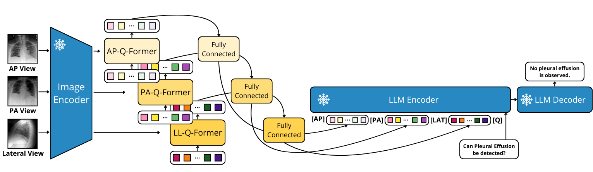

# BLIP-2-MultiView — Official Code Repository

This repository contains the **official implementation** of the second model baseline of the paper:

📄 **Paper:** *MIMIC-CXR-VQA: A Medical Visual Question Answering Dataset Constructed with LLaMA-based Annotations*


🔗 **Link:** [Comming Soon!!]

-----

## Model Architecture

Below is the architecture diagram used in the baseline:



-----

## Dataset

This work is built upon the **MIMIC-CXR-VQA** dataset:

🔗 **Link:** [Comming Soon!!]

📂 Directory Structure and Contents

To ensure the training scripts function correctly, you must download the dataset and set up the following structure.

### 1. Dataset Download and Placement

You need to download the CSV files for the **MIMIC-CXR-VQA** dataset.

### 3. Configure File Paths

Before running the experiments, verify the settings in the `paths.py` file.  
The only variable you are required to set correctly is:

- **`IMAGES_MIMIC_PATH`**: This must point to the root directory containing the actual MIMIC-CXR images.


## 1\. Environment Setup 🐍

Create and activate the conda environment:

```bash
conda env create -f environment.yml
conda activate blip2multiview
```

-----


## 2\. Running Experiments 🚀


### Base Training Pipeline

To execute the full training pipeline, follow these sequential steps:

1.  **Change Directory:** First, navigate to the training directory:
    ```bash
    cd train
    ```

2.  **Stage 1: NLL Training (Frozen Encoder)**
    Execute the initial Negative Log-Likelihood (NLL) training run with the model's encoder frozen:
    ```bash
    ./nll_train_freeze_econder.sh
    ```